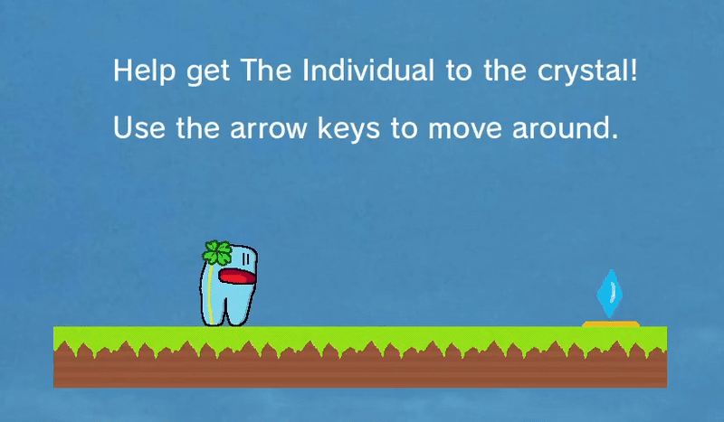
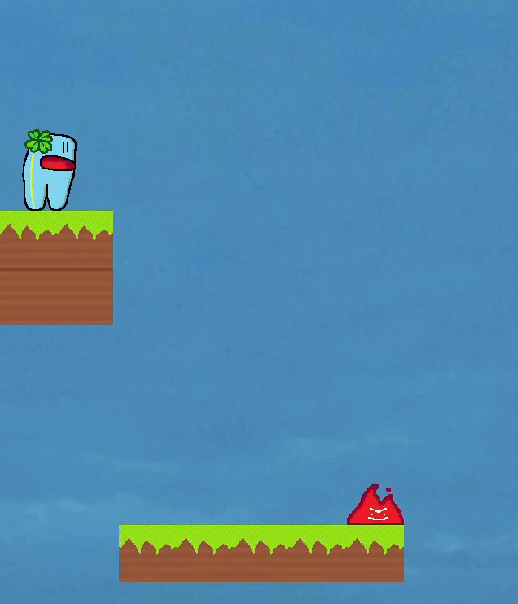
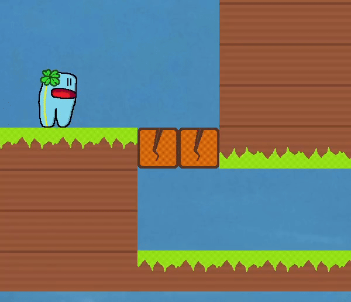
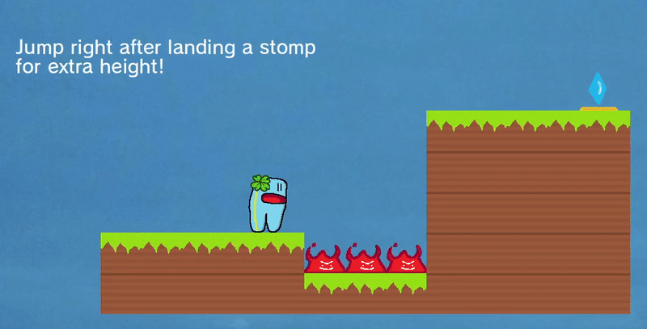
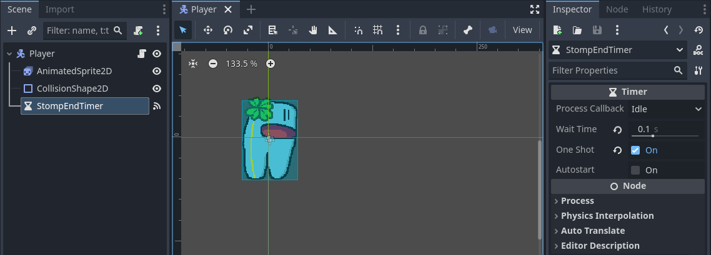
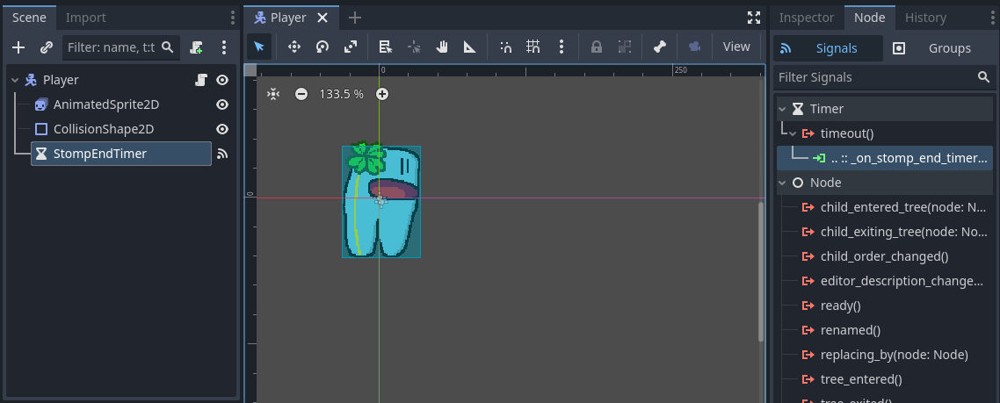
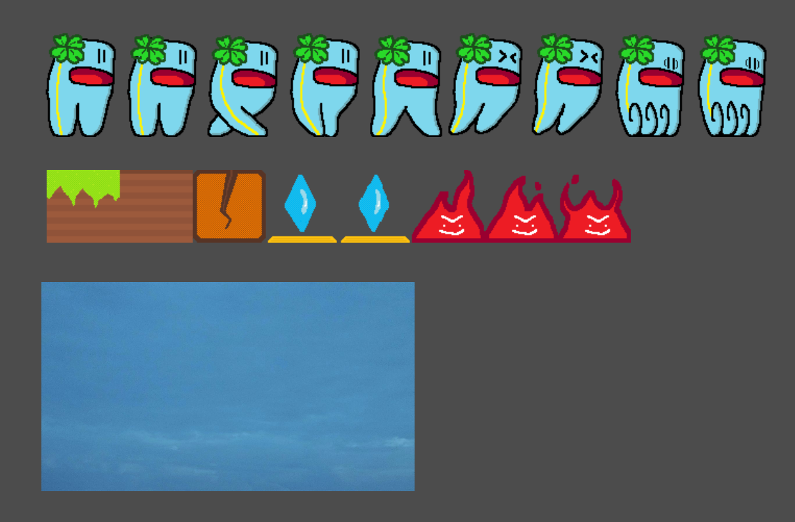
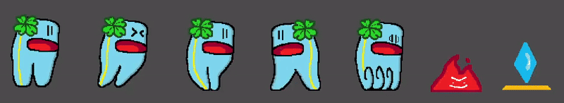
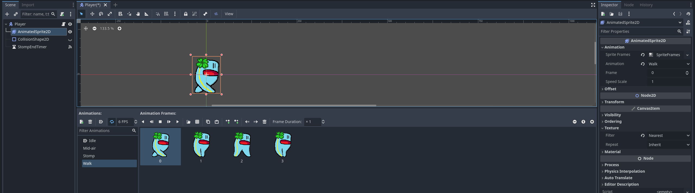

# Game Development - Tutorial 3

- **Name:** Feru Pratama Kartajaya
- **NPM:** 2106750351
- **Topic:** Introduction to Game Programming with GDScript for Implementing Basic 2D Game Mechanics

---

## Latihan Mandiri: Eksplorasi Mekanika Pergerakan

Dalam tutorial ini, saya telah mengimplementasi beberapa mekanika yang berhubungan dengan pergerakan karakter. Berikut merupakan deskripsi dari yang telah saya kerjakan:

### Basic Movement

Karakter digerakkan dengan menekan Arrow Keys pada keyboard. Karakter dapat berjalan secara horizontal dengan Left & Right Arrow. Karakter dapat meloncat dengan Up Arrow apabila sedang berdiri di lantai. Karakter tetap dapat bergerak saat sedang meloncat. Fitur-fitur berikut merupakan fitur minimum dari tutorial ini.



Berikut merupakan cuplikan script yang relevan dengan pergerakan dasar:

```
# Player.gd
@export var gravity = 200.0
@export var walk_speed = 200
@export var jump_speed = -300

func _physics_process(delta):
    # Apply gravity forces
	velocity.y += delta * gravity

	if Input.is_action_just_pressed("ui_up"):
		if is_on_floor():
            # Basic jump
			velocity.y = jump_speed

    # Walking horizontally
	if Input.is_action_pressed("ui_left"):
		velocity.x = -walk_speed
	elif Input.is_action_pressed("ui_right"):
		velocity.x = walk_speed
	else:
		velocity.x = 0
    
    # Move player character
    move_and_slide()
```

### Air Stomp

Saat karakter berada di udara, pemain dapat menekan Down Arrow untuk melakukan Air Stomp. Dengan Air Stomp, karakter akan diluncurkan ke bawah dengan kecepatan tinggi. Karakter masih dapat bergerak secara horizontal saat Air Stomp berlangsung. 



Selain untuk jatuh dengan cepat, Air Stomp dapat digunakan untuk menghancurkan tile Breakable untuk membuka jalur dalam sebuah level.



Berikut merupakan cuplikan script yang relevan dengan Air Stomp dan tile Breakable:

```
# Player.gd
@export var stomp_speed = 500
var is_stomping = false

func _physics_process(delta):
    velocity.y += delta * gravity

	if is_on_floor() and is_stomping:
        # End Stomp when landed
		is_stomping = false

	if not is_on_floor() and Input.is_action_just_pressed("ui_down"):
        # Start Stomp
		is_stomping = true
		velocity.y = stomp_speed

	move_and_slide()
```

```
# Stompable.gd
func _on_body_entered(body: Node2D):
	if body.name == "Player" and (body.is_stomping):
        # Deletes itself and other associated nodes
		self.queue_free()
```

### Stomp Bounce

Saat karakter mendarat setelah melakukan sebuah Air Stomp, terdapat jangka waktu yang singkat (sekitar 0.1 detik) di mana pemain dapat menekan Up Arrow untuk meloncat. Apabila loncatan dilakukan di dalam jangka waktu tersebut, karakter akan meloncat lebih tinggi dari biasanya. Teknik ini dapat digunakan untuk meraih platform yang lebih tinggi. Stomp Bounce tetap dapat dilakukan apabila karakter mendarat pada sebuah tile Breakable.



Implementasi ***input window*** dilakukan dengan node Timer bawaan Godot. Saat Air Stomp selesai, Timer akan mulai berjalan. Apabila Timer telah sampai 0, ia mengirimkan *signal* untuk memanggil fungsi yang mematikan Stomp Bounce.




Berikut merupakan cuplikan script yang relevan dengan Stomp Bounce:

```
# Player.gd
extends CharacterBody2D

@export var gravity = 200.0
@export var jump_speed = -300
@export var stomp_speed = 500
@export var bounce_multiplier = 1.5
var is_stomping = false
var stomp_bounce = false


func _physics_process(delta):
	velocity.y += delta * gravity

	if is_on_floor() and is_stomping:
        # End Stomp, start Bounce window
		is_stomping = false
		stomp_bounce = true
		$StompEndTimer.start()

	if Input.is_action_just_pressed("ui_up"):
		if stomp_bounce:
            # Give higher jump for Stomp Bounce
			velocity.y = jump_speed * bounce_multiplier
			stomp_bounce = false
		elif is_on_floor():
			velocity.y = jump_speed

	if not is_on_floor() and Input.is_action_just_pressed("ui_down"):
		is_stomping = true
		velocity.y = stomp_speed

	move_and_slide()

func _on_stomp_end_timer_timeout() -> void:
    # End Bounce window
	stomp_bounce = false
```

```
# Stompable.gd
func _on_body_entered(body: Node2D):
	if body.name == "Player" and (body.is_stomping or body.stomp_bounce):
		self.queue_free()
```

Selain menerapkan mekanika pergerakan unik terhadap karakter, saya juga telah melakukan beberapa hal dalam rangka polishing game.

### Assets Overhaul

Saya telah menambahkan sejumlah asset grafik buatan sendiri untuk menciptakan visual dari game. Grafik yang ditambahkan termasuk spritesheet karakter pemain, grafik tile dan objek game lainnya, serta background image.



### Animated Sprites

Karakter pemain memiliki beberapa jenis animasi sederhana yang akan ditampilkan pada aksi tertentu (idle, berjalan, meloncat, Air Stomp). Sprite karakter akan menghadapi arah sesuai dengan arah kecepatannya pada suatu saat. Beberapa objek di dalam level juga diberikan animasi sederhana untuk "menghidupkan" dunia game.



Implementasi animasi sprite dilakukan dengan node AnimatedSprite2D bawaan Godot. Setelah menyediakan sebuah spritesheet untuk digunakan, loop animasi dapat dibuat dengan frame yang diperoleh dari spritesheet tersebut. Satu sprite dapat memiliki banyak loop animasi yang dapat digunakan bergantian.



Berikut merupakan cuplikan script yang relevan dengan mengendalikan animasi karakter pemain:

```
# Player.gd
@onready var sprite = $AnimatedSprite2D

func _physics_process(delta):
    # Determine how to display sprite
	determine_sprite()

func determine_sprite():
    # Set sprite facing direction
	if velocity.x > 0:
		sprite.flip_h = false
	elif velocity.x < 0:
		sprite.flip_h = true

    # Set animation played
	if is_stomping:
		sprite.play("Stomp")
	elif not is_on_floor():
		sprite.play("Mid-air")
	elif velocity.x:
		sprite.play("Walk")
	else:
		sprite.play("Idle")
```

### Other Implementations

Terakhir, berikut merupakan beberapa implementasi lain yang telah saya terapkan pada project tutorial ini:

- Menambahkan rintangan pada level berupa Fire. Apabila karakter pemain menyentuh Fire, pemain kalah dan level akan diulang dari awal.

- Menambahkan script untuk DeathPlane di luar area kamera game. Apabila karakter pemain menyentuh/terjatuh ke dalam DeathPlane, pemain kalah dan level akan diulang dari awal.

- Menambahkan objektif level berupa Crystal. Apabila karakter pemain menyentuh Crystal, game akan berlanjut ke level berikutnya.

- Merangkai 10 level dengan kesulitan yang kurun meningkat.

- Menggunakan node RichTextLabel untuk menambahkan informasi tekstual berupa counter level dan helptext untuk mengajarkan fitur baru dalam game.

---

### Referensi

- Tutorial's GitHub page: https://csui-game-development.github.io/tutorials/tutorial-3/
- Official Godot GDScript reference: https://docs.godotengine.org/en/stable/tutorials/scripting/gdscript/gdscript_basics.html
- Official Godot Engine forums: https://forum.godotengine.org/
- Timers and Cooldowns in Godot 4 by Chonk: https://youtu.be/QFICFcD5pUI
- Easy Animated Character Sprites - Godot 4 Tutorial by Loafin Around: https://youtu.be/vDqPrBB9U5c