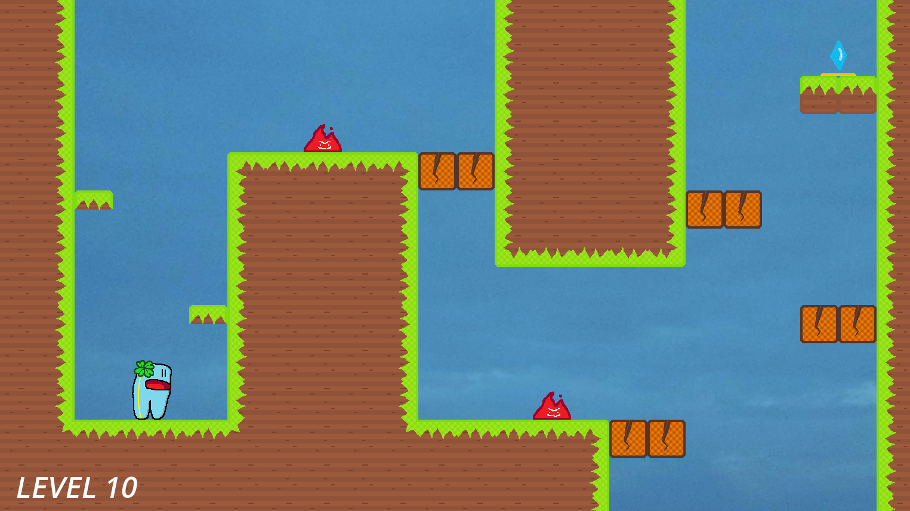

# Game Development - Tutorial 3

- **Name:** Feru Pratama Kartajaya
- **NPM:** 2106750351
- **Topic:** Introduction to Game Programming with GDScript for Implementing Basic 2D Game Mechanics

Commit: [14c8c7f](https://github.com/ferupk/CSUI-GD-tutorial-3/tree/14c8c7f7d692b8e7088bb12b27f6d2c93757f300)<br>
Release: [v1.0.0](https://github.com/ferupk/CSUI-GD-tutorial-3/releases/tag/v1.0.0)

---

## Latihan Mandiri: Eksplorasi Mekanika Pergerakan

Dalam tutorial ini, saya telah mengimplementasi beberapa mekanika yang berhubungan dengan pergerakan karakter. Berikut merupakan deskripsi dari yang telah saya kerjakan:

### Basic Movement

Karakter digerakkan dengan menekan Arrow Keys pada keyboard. Karakter dapat berjalan secara horizontal dengan Left & Right Arrow. Karakter dapat meloncat dengan Up Arrow apabila sedang berdiri di lantai. Karakter tetap dapat bergerak saat sedang meloncat. Fitur-fitur berikut merupakan fitur minimum dari tutorial ini.


Berikut merupakan cuplikan script yang relevan dengan pergerakan dasar:

```py
# Player.gd
@export var gravity = 200.0
@export var walk_speed = 200
@export var jump_speed = -300

func _physics_process(delta):
    # Apply gravity forces
    velocity.y += delta * gravity

	if Input.is_action_just_pressed("ui_up"):
		if is_on_floor():
            # Basic jump
			velocity.y = jump_speed

    # Walking horizontally
	if Input.is_action_pressed("ui_left"):
		velocity.x = -walk_speed
	elif Input.is_action_pressed("ui_right"):
		velocity.x = walk_speed
	else:
		velocity.x = 0
    
    # Move player character
    move_and_slide()
```

### Air Stomp

Saat karakter berada di udara, pemain dapat menekan Down Arrow untuk melakukan Air Stomp. Dengan Air Stomp, karakter akan diluncurkan ke bawah dengan kecepatan tinggi. Karakter masih dapat bergerak secara horizontal saat Air Stomp berlangsung. 


Selain untuk jatuh dengan cepat, Air Stomp dapat digunakan untuk menghancurkan tile Breakable untuk membuka jalur dalam sebuah level.


Berikut merupakan cuplikan script yang relevan dengan Air Stomp dan tile Breakable:

```py
# Player.gd
@export var stomp_speed = 500
var is_stomping = false

func _physics_process(delta):
    velocity.y += delta * gravity

	if is_on_floor() and is_stomping:
        # End Stomp when landed
		is_stomping = false

	if not is_on_floor() and Input.is_action_just_pressed("ui_down"):
        # Start Stomp
		is_stomping = true
		velocity.y = stomp_speed

	move_and_slide()
```

```py
# Stompable.gd
func _on_body_entered(body: Node2D):
	if body.name == "Player" and (body.is_stomping):
        # Deletes itself and other associated nodes
		self.queue_free()
```

### Stomp Bounce

Saat karakter mendarat setelah melakukan sebuah Air Stomp, terdapat jangka waktu yang singkat (sekitar 0.1 detik) di mana pemain dapat menekan Up Arrow untuk meloncat. Apabila loncatan dilakukan di dalam jangka waktu tersebut, karakter akan meloncat lebih tinggi dari biasanya. Teknik ini dapat digunakan untuk meraih platform yang lebih tinggi. Stomp Bounce tetap dapat dilakukan apabila karakter mendarat pada sebuah tile Breakable.


Implementasi ***input window*** dilakukan dengan node Timer bawaan Godot. Saat Air Stomp selesai, Timer akan mulai berjalan. Apabila Timer telah sampai 0, ia mengirimkan *signal* untuk memanggil fungsi yang mematikan Stomp Bounce.


Berikut merupakan cuplikan script yang relevan dengan Stomp Bounce:

```py
# Player.gd
extends CharacterBody2D

@export var gravity = 200.0
@export var jump_speed = -300
@export var stomp_speed = 500
@export var bounce_multiplier = 1.5
var is_stomping = false
var stomp_bounce = false


func _physics_process(delta):
	velocity.y += delta * gravity

	if is_on_floor() and is_stomping:
        # End Stomp, start Bounce window
		is_stomping = false
		stomp_bounce = true
		$StompEndTimer.start()

	if Input.is_action_just_pressed("ui_up"):
		if stomp_bounce:
            # Give higher jump for Stomp Bounce
			velocity.y = jump_speed * bounce_multiplier
			stomp_bounce = false
		elif is_on_floor():
			velocity.y = jump_speed

	if not is_on_floor() and Input.is_action_just_pressed("ui_down"):
		is_stomping = true
		velocity.y = stomp_speed

	move_and_slide()

func _on_stomp_end_timer_timeout() -> void:
    # End Bounce window
	stomp_bounce = false
```

```py
# Stompable.gd
func _on_body_entered(body: Node2D):
	if body.name == "Player" and (body.is_stomping or body.stomp_bounce):
		self.queue_free()
```

Selain menerapkan mekanika pergerakan unik terhadap karakter, saya juga telah melakukan beberapa hal dalam rangka polishing game.

### Assets Overhaul

Saya telah menambahkan sejumlah asset grafik buatan sendiri untuk menciptakan visual dari game. Grafik yang ditambahkan termasuk spritesheet karakter pemain, grafik tile dan objek game lainnya, serta background image.


### Animated Sprites

Karakter pemain memiliki beberapa jenis animasi sederhana yang akan ditampilkan pada aksi tertentu (idle, berjalan, meloncat, Air Stomp). Sprite karakter akan menghadapi arah sesuai dengan arah kecepatannya pada suatu saat. Beberapa objek di dalam level juga diberikan animasi sederhana untuk "menghidupkan" dunia game.


Implementasi animasi sprite dilakukan dengan node AnimatedSprite2D bawaan Godot. Setelah menyediakan sebuah spritesheet untuk digunakan, loop animasi dapat dibuat dengan frame yang diperoleh dari spritesheet tersebut. Satu sprite dapat memiliki banyak loop animasi yang dapat digunakan bergantian.


Berikut merupakan cuplikan script yang relevan dengan mengendalikan animasi karakter pemain:

```py
# Player.gd
@onready var sprite = $AnimatedSprite2D

func _physics_process(delta):
    # Determine how to display sprite
	determine_sprite()

func determine_sprite():
    # Set sprite facing direction
	if velocity.x > 0:
		sprite.flip_h = false
	elif velocity.x < 0:
		sprite.flip_h = true

    # Set animation played
	if is_stomping:
		sprite.play("Stomp")
	elif not is_on_floor():
		sprite.play("Mid-air")
	elif velocity.x:
		sprite.play("Walk")
	else:
		sprite.play("Idle")
```

### Other Implementations

Terakhir, berikut merupakan beberapa implementasi lain yang telah saya terapkan pada project tutorial ini:

- Menambahkan rintangan pada level berupa Fire. Apabila karakter pemain menyentuh Fire, pemain kalah dan level akan diulang dari awal.

- Menambahkan script untuk DeathPlane di luar area kamera game. Apabila karakter pemain menyentuh/terjatuh ke dalam DeathPlane, pemain kalah dan level akan diulang dari awal.

- Menambahkan objektif level berupa Crystal. Apabila karakter pemain menyentuh Crystal, game akan berlanjut ke level berikutnya.

- Merangkai 10 level dengan kesulitan yang kurun meningkat.

- Menggunakan node RichTextLabel untuk menambahkan informasi tekstual berupa counter level dan helptext untuk mengajarkan fitur baru dalam game.

---

### Referensi

- Tutorial's GitHub page: https://csui-game-development.github.io/tutorials/tutorial-3/
- Official Godot GDScript reference: https://docs.godotengine.org/en/stable/tutorials/scripting/gdscript/gdscript_basics.html
- Official Godot Engine forums: https://forum.godotengine.org/
- Timers and Cooldowns in Godot 4 by Chonk: https://youtu.be/QFICFcD5pUI
- Easy Animated Character Sprites - Godot 4 Tutorial by Loafin Around: https://youtu.be/vDqPrBB9U5c

---

# Game Development - Tutorial 5

- **Name:** Feru Pratama Kartajaya
- **NPM:** 2106750351
- **Topic:** Assets Creation & Integration

Commit: [bdc536c](https://github.com/ferupk/CSUI-GD-tutorial-3/tree/bdc536cd5ef8d3e9677d0d79c8a42ec3178aa1dd)<br>
Release: [v1.1.0](https://github.com/ferupk/CSUI-GD-tutorial-3/releases/tag/v1.1.0)

---

## Latihan Mandiri: Membuat dan Menambah Variasi Aset

### Improved Player Input Handling

#### Custom Input Mapping

Input mapping baru telah ditambahkan untuk menangani input yang akan menggerakkan karakter Player. Sekarang, pemain dapat menggunakan Arrow Keys dan WASD untuk menggerakkan karakter. Layout dari input (pergerakan horizontal, meloncat, stomp) tidak berubah dari Tutorial 3.


#### Reworked Player Script

Cara game menangani input Player telah disesuaikan untuk menyerupai struktur yang diberikan pada Tutorial 5. Perubahan yang signifikan terjadi pada kalkulasi pergerakan horizontal dan sistem pemilihan sprite dari karakter.

```py
# Player.gd
func _physics_process(delta: float) -> void:
	velocity.y += delta * gravity
	_handle_input()
	move_and_slide()

func _handle_input():
	# ... jump and stomp handling is the same ...

	# Horizontal movement
	var direction := Input.get_axis("move_left", "move_right")
	if direction:
		velocity.x = direction * walk_speed
		# Sprite direction
		if direction > 0:
			sprite.flip_h = false
		else:
			sprite.flip_h = true
	else:
		velocity.x = move_toward(velocity.x, 0, walk_speed)

	# Determine animation
	var animation = "Idle"
	if is_stomping:
		animation = "Stomp"
	elif not is_on_floor():
		animation = "Mid-air"
	elif direction:
		animation = "Walk"

	# Play animation
	if sprite.animation != animation:
		sprite.play(animation)
```

#### Disabling Player Input

Fungsi `_disable_movement()` telah ditambahkan untuk membuat Player tidak menerima input dari Pemain. Fitur ini akan berguna untuk situasi di mana Player diperlukan diam pada satu posisi, seperti pada scene menu atau saat mencapai akhir dari level. Fungsi dapat dipanggil secara langsung maupun dengan memilih properti "No Control" pada node Player.

```py
# Player.gd
@export var no_control = false

var controllable = true


func _ready() -> void:
	if no_control:
		_disable_movement()


func _physics_process(delta: float) -> void:
	velocity.y += delta * gravity
	if controllable:
		_handle_input()
	move_and_slide()


func _disable_movement() -> void:
	controllable = false
	velocity = Vector2(0, 0)
```


### Player Animations & Sound Effects

#### SFX for Player Actions

Beberapa SFX telah ditambahkan untuk mengiringi aksi yang dilakukan oleh Player. SFX akan dimainkan untuk aksi-aksi berikut: Player meloncat, Player melakukan stomp, Player mendarat setelah stomp, dan Player melakukan stomp bounce. SFX yang digunakan berasal dari website asset SFX dan dimodifikasi lebih lanjut oleh saya.

```py
# Player.gd
@onready var sfx = {
	"Jump": $SFX/Jump,
	"Stomp": $SFX/Stomp,
	"Bounce": $SFX/StompBounce,
	"Slam": $SFX/Slam,
}


func _handle_input():
	# Landing an air stomp
	if is_on_floor() and is_stomping:
		is_stomping = false
		sfx.Slam.play()

		# Start stomp bounce period
		stomp_bounce = true
		$StompEndTimer.start()

	if Input.is_action_just_pressed("jump"):
		# Stomp bounce
		if stomp_bounce:
			velocity.y = jump_speed * bounce_multiplier
			stomp_bounce = false
			sfx.Bounce.play()
		# Regular jump
		elif is_on_floor():
			velocity.y = jump_speed
			sfx.Jump.play()

	# Starting an air stomp
	if not is_on_floor() and Input.is_action_just_pressed("stomp"):
		is_stomping = true
		velocity.y = stomp_speed
		sfx.Stomp.play()
```


#### New Actions for Dying and Winning

Player memiliki dua aksi baru yang dapat dilakukannya: mati saat terkena rintangan dan selebrasi saat menyelesaikan level. Dua aksi ini dapat dipanggil dengan fungsi `kill()` dan `win()`. Kedua fungsi akan memanggil `_disable_movement()` untuk menghentikan pergerakan pemain dan menjalankan animasi yang sesuai. Untuk aksi mati, ada tambahan SFX untuk teriakan.

```py
# Player.gd
@onready var sprite = $AnimatedSprite2D
@onready var sfx = {
	"Jump": $SFX/Jump,
	"Scream": $SFX/Scream,
	"Stomp": $SFX/Stomp,
	"Bounce": $SFX/StompBounce,
	"Slam": $SFX/Slam,
}


func _disable_movement() -> void:
	controllable = false
	velocity = Vector2(0, 0)


func kill() -> void:
	# Kill player
	_disable_movement()
	sfx.Scream.play()
	sprite.play("Die")


func win() -> void:
	# Player wins
	_disable_movement()
	sprite.play("Win")
```


### Death Rework

#### Player-Obstacle Interaction

Terdapat 2 rintangan yang dapat membunuh Player: Fire yang diletakkan di sekitar level, dan DeathPlane yang membordir level di luar jangkauan kamera. Sebelumnya, menyentuh sebuah rintangan akan mengakibatkan script untuk langsung reload scene. Sekarang, script akan memanggil fungsi kill() untuk membunuh Player sebelum reload scene.

```py
# DeathPlane.gd dan FireHitbox.gd
extends Area2D


func _on_body_entered(body: Node2D):
	if body.name == "Player":
		body.kill()
		await get_tree().create_timer(2.5).timeout
		get_tree().call_deferred("reload_current_scene")
```

#### Delay Before Respawn

Diberikan jeda sekitar 3 detik antara menyentuh rintangan hingga reload scene. Jeda ini ditambahkan agar proses mati tidak berasa tiba-tiba. Waktu ini juga dimanfaatkan agar segala SFX dan animasi dapat selesai sebelum reload scene.

### Breakable Tile Rework

#### New Tile Breaking Action

Sebelumnya, tile Breakable terdiri dari sprite statis dan akan langsung dihapus setelah terkena stomp Player. Sekarang, terdapat animasi yang menunjukkan tile hancur dengan bantuan AnimatedSprite2D. Agar fungsionalitas tile Breakable tidak berubah karena penambahan animasi, script telah dimodifikasi untuk mematikan collision dan memainkan animasi secara terpisah. Hal ini memungkinkan Player untuk menembus tile Breakable selama animasi hancur berlangsung. Hancurnya tile Breakable juga diiringi oleh SFX baru.

```py
# Stompable.gd

extends Node2D

@onready var break_sound = $AudioStreamPlayer


func _on_body_entered(body: Node2D):
	if body.name == "Player" and (body.is_stomping or body.stomp_bounce):
		await _break()
		self.queue_free()


func _break():
	$CollisionShape2D.call_deferred("set_disabled", true)

	for sprite in $Sprites.get_children():
		sprite.play("Break")

	break_sound.play()
	await break_sound.finished
```


### Crystal and Winning Rework

#### Player-Crystal Interaction

Player menuju ke Crystal untuk lanjut ke level selanjutnya. Sebelumnya, menyentuh Crystal akan mengakibatkan script untuk langsung load level selanjutnya. Sekarang, script akan memanggil fungsi win() untuk membuat Player selebrasi sebelum load level baru. Crystal juga akan memainkan SFX kemenangan.

```py
# Crystal.gd
extends Node2D

@export var target_level = 1

@onready var sfx = {
	"Win": $SFX/Win,
}


func _on_area_2d_body_entered(body: Node2D):
	if body.name == "Player":
		body.win()
		sfx.Win.play()
		await get_tree().create_timer(3.5).timeout

		get_tree().call_deferred(
			"change_scene_to_file", "res://scenes/levels/Level%s.tscn" % target_level
		)
```

#### Delay Between Levels

Diberikan jeda sekitar 4 detik antara menyentuh Crystal hingga load level selanjutnya. Jeda ini ditambahkan untuk memberikan waktu rehat antara level, serta membiarkan animasi Player dan SFX kemenangan lanjut berjalan.

#### Humming SFX Relative to Player Position

Sebelumnya, semua SFX pada game memanfaatkan node AudioStreamPlayer. Node ini memiliki sifat non-positional, yang berarti audio akan dimainkan dengan volume yang sama pada posisi manapun. Sekarang, Crystal memainkan SFX dengungan dengan node AudioStreamPlayer2D. Berbeda dengan AudioStreamPlayer biasa, volume audio yang dimainkan node ini akan terpengaruh oleh jarak Crystal ke pendengar.

Player telah diperbarui dengan node AudioListener2D yang akan mendengar audio yang berada di sekitarnya. Dengan ini, volume dari dengungan Crystal akan relatif terhadap posisi Player di level. Dengungan akan mulai terdengar saat Player berjarak sekitar 5 tile dari Crystal dan akan semakin keras semakin dekat Player dengan Crystal. Selain itu, dengungan akan perlahan berhenti setelah Player menyentuh Crystal. Sifat ini diimplementasikan secara manual dengan bantuan Tween.

```py
# Crystal.gd
const FADE_TRANS = Tween.TRANS_SINE
const FADE_DURATION = 1

@onready var fade_out_tween: Tween
@onready var sfx = {
	"Hum": $SFX/Hum,
	"Win": $SFX/Win,
}


func _on_area_2d_body_entered(body: Node2D):
	if body.name == "Player":
		body.win()
		sfx.Win.play()
		_end_hum()
		await get_tree().create_timer(3.5).timeout

		get_tree().call_deferred(
			"change_scene_to_file", "res://scenes/levels/Level%s.tscn" % target_level
		)


func _end_hum():
	fade_out_tween = create_tween()
	fade_out_tween.tween_property(sfx.Hum, "volume_db", -80, FADE_TRANS).set_trans(FADE_TRANS)

	await fade_out_tween.finished
	sfx.Hum.stop()
```


#### Flag to End Game

Terdapat properti baru untuk node Crystal bernama "Last". Apabila diaktifkan, Crystal akan berperan sebagai goal terakhir dari game. Saat Player menyentuh Crystal, game tamat dan script akan load ke End scene.

```py
# Crystal.gd
@export var last = false


func _on_area_2d_body_entered(body: Node2D):
	if body.name == "Player":
		body.win()
		sfx.Win.play()
		_end_hum()
		await get_tree().create_timer(3.5).timeout

		if last:
			get_tree().call_deferred("change_scene_to_file", "res://scenes/levels/End.tscn")
		else:
			get_tree().call_deferred(
				"change_scene_to_file", "res://scenes/levels/Level%s.tscn" % target_level
			)
```


### Level Layout Rework

#### Switched from individual nodes to TileMapLayer

Sebelumnya, setiap tile dan objek yang merangkai sebuah level merupakan nodenya tersendiri. Implementasi seperti ini akan memenuhi scene tree dengan cepat dan menyulitkan perancangan level. Ukuran dan posisi tile yang tidak dinormalisasi juga membuat struktur level tidak rapi. Sekarang, pendefinisian layout level telah dikonversi ke dalam bentuk TileMapLayer. Tilemap mengandung world tile yang digunakan untuk membangun layout, lengkap dengan collision dan ordering yang sesuai. Tilemap juga menyimpan objek Fire dan tile Breakable dalam bentuk PackedScene. Hal ini bertujuan untuk memudahkan penambahan kedua objek tersebut ke dalam level dan menjaga agar posisi mereka sesuai dengan world tile.


Terdapat satu objek yang tidak termasuk dalam tilemap, yaitu Crystal. Ini disebabkan oleh implementasi tilemap yang mengkonversi setiap objek yang dimasukkan ke dalamnya sebagai PackedScene. Dalam bentuk PackedScene, properti-properti dari objek tidak dapat diubah melalui panel Inspector seperti biasa. Properti Crystal perlu diakses untuk mengubah scene yang dituju saat berpindah level, sehingga kemampuan untuk mengubah properti harus dipertahankan. Oleh karena itu, Crystal tetap ditambahkan sebagai child node dari level seperti sebelumnya.

Dalam melakukan konversi layout dari node individu ke tilemap, mayoritas dari desain level yang telah dibuat pada saat Tutorial 3 masih terjaga. Sedikit perubahan yang ada bertujuan untuk memantapkan posisi objek di dalam level, serta mengakomodasi untuk ukuran tile yang mengecil dari sebelumnya (70x70 ke 64x64).

#### Updated Tileset spritesheet

Spritesheet dari tileset telah diperbarui dengan tile-tile baru yang bermakna untuk mempercakap desain level. Perubahan dari tilemap adalah sebagai berikut:

- Menambahkan tile rumput untuk dengan tiga tipe: floor (lurus), edge (ujung luar), dan corner (ujung dalam). Setiap tile memiliki 4 orientasi berbeda. Metode ini dipilih dibandingkan sekedar rotate tile agar pola dithering pada sprite terjaga untuk semua tile.
- Menambahkan tile satuan dengan ukuran setengah (slab). Tile ini dapat digunakan sebagai pengganti tile satuan biasa untuk memberikan ruang lebih apabila layout level terasa sempit.
- Menambahkan tile dekorasi berupa bunga dengan animasi 2 frame. Tile ini tidak memiliki collision dan terletak 1 Z-index di belakang tile lainnya. Mode animasi telah diset menjadi random sehingga setiap tile bunga akan bergerak pada waktu yang berbeda.


#### Level Structuring Improvements

Berikut merupakan beberapa contoh perbandingan antara layout level di Tutorial 3 dan Tutorial 5. Struktur dari level telah ditingkatkan dengan implementasi tilemap dan bentuk-bentuk tile baru.




### Global Background Music

#### Autoload Controller for BGM

Dalam tutorial ini, kami diajarkan cara menggunakan AudioStreamPlayer untuk memainkan BGM di dalam sebuah scene. Konsep ini telah ditingkatkan menjadi sebuah controller global yang akan memainkan BGM terlepas dengan scene yang sedang ditampilkan. BackgroundMusicControl merupakan scene yang akan otomatis ditambahkan pada scene tree saat game dimulai. Controller ini memiliki kemampuan untuk menyiapkan, memainkan, dan menghentikan BGM melalui script. Karena implementasi BGM tidak terhubung kepada scene yang sedang digunakan, game dapat berpindah antara scene tanpa harus menginterupsi dan memainkan ulang BGM. Fitur ini membawakan pengalaman game yang lebih seamless, serta memungkinkan penggunaan BGM dengan durasi yang lebih panjang tanpa harus terpotong setiap berganti scene.

```py
# BackgroundMusicControl.gd
extends Node2D

var default_bgm = load("res://assets/sounds/bgm.ogg")


func _ready() -> void:
	$BGM.stream = default_bgm


func play() -> void:
	$BGM.play()


func stop() -> void:
	$BGM.stop()
```


### Audio Bus

#### Allocate Buses to Different Sound Types

Audio Bus merupakan fitur dari Godot yang memungkinkan developer untuk mengkontrol pembagian dan routing dari audio yang dimainkan dalam game. Dengan audio bus, sekelompok audio dapat diatur volume dan diberikan efek sebelum di-route ke bus Master (bus yang audionya akan dimainkan ke speaker pemain). Walaupun saya belum memanfaatkan fitur-fitur yang disediakan oleh audio bus, saya telah menciptakan 3 bus untuk mengelompokkan audio dalam game. 3 bus yang telah dibuat digunakan untuk BGM, SFX dari Player, dan SFX dari objek lain di dalam level.


### Start/End Sequence

#### New Scenes for Game Start and End

Dalam rangka polishing alur game lebih lanjut, saya telah menambahkan dua scene yang berperan sebagai Start dan End dari level. Pada scene Start, terdapat sebuah TextureButton yang akan memulai game saat diklik. Untuk memulai game, BGM akan dimainkan dan level pertama akan diload. Pada scene End, terdapat pesan apresiasi bagi pemain yang telah menyelesaikan game. Setelah beberapa detik di scene End, game akan menghentikan BGM dan berpindah kembali ke scene Start.

```py
# StartGame.py
extends TextureButton


func _on_pressed() -> void:
	BackgroundMusicControl.play()
	get_tree().call_deferred("change_scene_to_file", "res://scenes/levels/Level1.tscn")
```


```py
# EndGame.py
extends Node2D


func _ready() -> void:
	$Player.win()
	await get_tree().create_timer(5).timeout
	BackgroundMusicControl.stop()
	get_tree().call_deferred("change_scene_to_file", "res://scenes/levels/Start.tscn")

```


### Checklist

- [x] Membuat minimal 1 (satu) objek baru di dalam permainan yang dilengkapi dengan animasi menggunakan _spritesheet_ selain yang disediakan tutorial. Silakan cari _spritesheet_ animasi di beberapa koleksi aset gratis seperti Kenney.

Objek unik telah ditambahkan pada tutorial sebelumnya dalam bentuk Fire, Crystal, dan tile Breakable. Fire dan Crystal sudah memiliki animasi dengan spritesheet buatan sendiri sejak tutorial 3, dan tile Breakable telah ditambahkan animasi pada tutorial ini.

- [x] Membuat minimal 1 (satu) audio untuk efek suara (SFX) dan memasukkannya ke dalam permainan. Kamu dapat membuatnya sendiri atau mencari dari koleksi aset gratis.

Terdapat 7 SFX yang telah ditambahkan. Salah satunya (scream.wav) adalah buatan sendiri dan sisanya didapat dari koleksi aset gratis. Dari ketujuh SFX yang ada, 5 digunakan untuk mengiringi aksi Player, 1 digunakan untuk tile Breakable, dan 1 digunakan untuk Crystal.

- [x] Membuat minimal 1 (satu) musik latar (_background music_) dan memasukkannya ke dalam permainan. Kamu dapat membuatnya sendiri atau mencari dari koleksi aset gratis.

Terdapat 1 BGM yang telah ditambahkan dari koleksi aset gratis. BGM dimainkan melalui controller global yang terus berjalan selama game berlangsung.

- [x] Implementasikan interaksi antara objek baru tersebut dengan objek yang dikendalikan pemain. Misalnya, pemain dapat menciptakan atau menghilangkan objek baru tersebut ketika menekan suatu tombol atau tabrakan dengan objek lain di dunia permainan.

Saat Player menyentuh Fire, ia akan mati dengan animasi unik dan level akan reload.  Saat Player menyentuh Crystal, ia akan melakukan selebrasi dan berpindah ke level berikutnya. Player dapat menghancurkan tile Breakable dengan gerakan stomp dan tile akan hancur dengan animasi unik.

- [x] Implementasikan _audio feedback_ dari interaksi antara objek baru dengan objek pemain. Misalnya, muncul efek suara ketika pemain tabrakan dengan objek baru.

Saat Player mati karena menyentuh rintangan, ia akan memainkan SFX teriakan. Saat Player mencapai Crystal, Crystal akan memainkan SFX kemenangan dan dengungan akan berhenti. Saat Player menghancurkan tile Breakable, SFX balok hancur akan dimainkan.

- [x] (Ide) Implementasi sistem audio yang relatif terhadap posisi objek. Misalnya, musik latar akan semakin terdengar samar ketika pemain semakin jauh dari posisi awal level.

Suara dengungan yang dikeluarkan oleh Crystal relatif terhadap posisi Player dan akan semakin keras apabila Player mendekatinya.

### Asset Credits

Game Jump Sound - Boing (1 of 2) by el_boss<br>
License: Creative Commons 0<br>
https://freesound.org/s/751698/

Swoosh 1 by D4XX<br>
License: Creative Commons 0<br>
https://freesound.org/s/607252/

stomp2.WAV by stomachache<br>
License: Creative Commons 0<br>
https://freesound.org/s/46521/

crystal_loop_withhum.wav by markians<br>
License: Creative Commons 0<br>
https://freesound.org/s/511772/

SFX_ext_brick throw_ 242031 Wian Heyns_OWsfx by vreemdemens<br>
License: Attribution NonCommercial 4.0<br>
https://freesound.org/s/765772/

Success Fanfare Trumpets by FunWithSound (Freesound)<br>
https://pixabay.com/sound-effects/success-fanfare-trumpets-6185/

"Shiny Tech II" Kevin MacLeod (incompetech.com)<br>
Licensed under Creative Commons: By Attribution 4.0 License<br>
http://creativecommons.org/licenses/by/4.0/


### Referensi
- Tutorial's GitHub page: https://csui-game-development.github.io/tutorials/tutorial-5/
- Official Godot GDScript reference: https://docs.godotengine.org/en/stable/tutorials/scripting/gdscript/gdscript_basics.html
- Official Godot Engine forums: https://forum.godotengine.org/
- How to Create Animated TileSets in Godot 4 by DevDuck: https://youtu.be/AO-pqAvzowk
- Playing Sounds Effects and Music in Godot 4 by Brett Makes Games: https://youtu.be/N6-2Iwb8xoU
- How to Keep Music Between Scenes? Godot 3 Autoload Tutorial by Rafa Fiedo: https://youtu.be/xT51BO8KrIg
- How to Fade In/Out an Audio Stream? asked by paradigmo: https://forum.godotengine.org/t/how-to-fade-in-out-an-audio-stream/27234/2